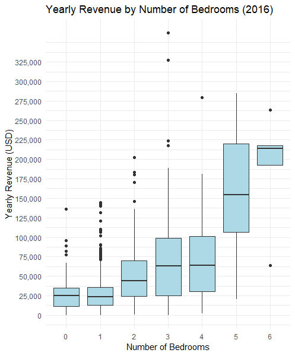
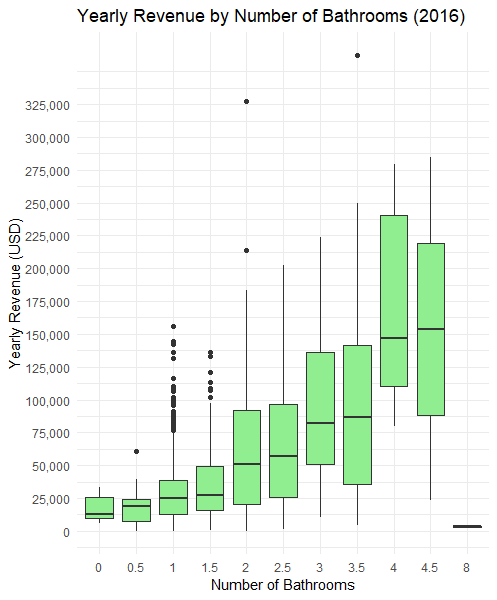
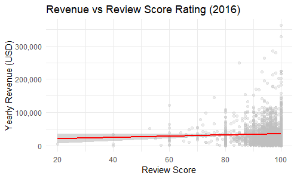

# Airbnb Revenue Analysis (2016)

This project explores the relationship between Airbnb listing features and yearly revenue using real-world data from 2016. By examining how factors such as bedrooms, bathrooms, and review scores impact a listing's yearly revenue, this analysis aims to offer insight for those considering purchasing a property to rent out with Airbnb.

To further explore trends across geographic areas and listing features, an interactive Tableau dashboard is available here:  
[Tableau Dashboard](https://public.tableau.com/app/profile/william.jennings4026/viz/AirbnbPriceExploration/Dashboard1?publish=yes)

---

## Data Source

[Inside Airbnb – Get the Data](https://www.insideairbnb.com/get-the-data/)

---

## Project Goals

- Investigate key features influencing yearly revenue  
- Visualize trends across bedroom and bathroom counts  
- Build a linear regression model to quantify impact  

---

## Revenue by Number of Bedrooms

Revenue generally increases with more bedrooms, with a notable jump in median earnings around 5-bedroom listings. Outliers with very high revenue exist in each category, likely due to luxury or frequently booked properties.

---

## Revenue by Number of Bathrooms

Similar to bedroom count, more bathrooms tend to correlate with higher yearly revenue. Listings with 4+ bathrooms tend to perform particularly well, indicating a potential premium on larger, more accommodating spaces.

---

## Revenue by Review Scores

Interestingly, review scores were not a strong or statistically significant factor in yearly revenue. While very low scores are rare and may slightly affect revenue, most listings cluster around similar earnings regardless of ratings.

A visible trend is the clustering of listings at scores like 60, 80, and 100—possibly due to a low number of reviews. These may warrant exclusion in future analysis.

---

## Linear Regression Summary

| Term                | Estimate  | Std. Error | t-value | p-value   | 95% CI (Lower) | 95% CI (Upper) |
|---------------------|-----------|------------|---------|-----------|----------------|----------------|
| (Intercept)         | -6,021    | 7,841      | -0.768  | 0.443     | -21,402        | 9,359          |
| Bedrooms            | **13,390**    | 862        | 15.5    | **< 2e-16** | 11,699         | 15,081         |
| Bathrooms           | **15,162**    | 1,279      | 11.9    | **< 2e-16** | 12,655         | 17,670         |
| Review Score Rating | 56.3      | 82.6       | 0.681   | 0.496     | -105           | 218            |

---

## Model Fit Metrics

- **R-squared**: 0.311  
- **Adjusted R-squared**: 0.310  
- **Residual Std. Error**: 27,630 (on 2,311 DF)  
- **F-statistic**: 347.9 on 3 and 2,311 DF  
- **Overall model p-value**: < 2.2e-16  

The regression analysis indicates a moderate fit—about 31% of the variation in yearly revenue is explained by the model. The **F-statistic and its very low p-value** show that the model as a whole is statistically significant—at least one predictor contributes meaningfully to explaining revenue.

---

## Key Findings

- Bedrooms and bathrooms are both statistically significant predictors of revenue:
  - **+$13,390** per additional bedroom  
  - **+$15,162** per additional bathroom  
  - (both p < 2e-16)

- Review Score Rating, despite assumptions, is **not** statistically significant. Possible reasons:
  - Limited variation: most listings have high scores  
  - Revenue may depend more on physical features and availability than on slight differences in score  

While the positive effect of bedrooms and bathrooms may seem intuitive, this analysis **quantifies** those effects and provides data-backed confirmation of where intuition aligns — or doesn’t.

---

## Further Research

- The R-squared value of 0.311 suggests a large portion of revenue variance remains unexplained. Future work could include:
  - Location data  
  - Availability and booking frequency  
  - Amenities offered  
  - Seasonal pricing effects  
  - Minimum stay requirements

- Filtering out inactive listings (e.g., those with very few stays or limited availability) could improve model accuracy by reducing noise.

- A comparison with **real estate pricing** could help assess whether the additional income from larger properties justifies the higher purchase cost.

---

## Tools Used

- **R** (`tidyverse`, `ggplot2`, `broom`) – data cleaning, visualization, and regression modeling  
- **Excel** – original data inspection and preparation  
- **Tableau** – interactive dashboard visualizations  
- **Git/GitHub** – version control and project documentation  
